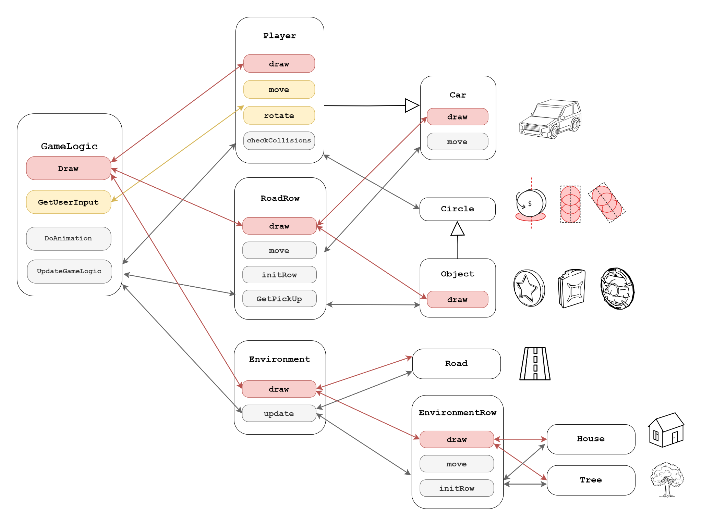

# RoadRush – Anatomy & Design Rationale

> *A technical walkthrough of how the game thinks, moves and draws – not a how‑to‑compile guide.*

 <br/>
*Figure 1 – Class ownership & call flow. Red arrows = **draw** calls, gold = **input**, grey = general method calls.*

---

## 1 · Gameplay loop at a glance

while (window open) {
    GetUserInput();          // keyboard → intent
    UpdateGameLogic(dt);     // spawn / move / collide
    DoAnimation(dt);         // interpolate visuals
    Draw();                  // raster pass
}


* Everything funnels through **`GameLogic`**, a façade that hides subsystems yet keeps the main loop readable.
* **Fixed‑timestep physics** (typically 60 Hz) decoupled from the monitor’s refresh for consistent behaviour.

---

## 2 · Core subsystems

| Block              | Responsibility                                                                                           | Key public messages                            |
| ------------------ | -------------------------------------------------------------------------------------------------------- | ---------------------------------------------- |
| **Player**         | Holds the player car’s transform, velocity and health. Runs collision checks and reacts to pick‑ups.     | `move(∆t)`, `rotate(key)`, `checkCollisions()` |
| **RoadRow**        | One 4‑lane road slice. Moves backwards, knows which lane contains a **Car** or **Object**.               | `initRow(z)`, `move(∆t)`, `getPickUp()`        |
| **EnvironmentRow** | Decorative props (house, tree) placed at each side of the road to convey speed.                          | `initRow(z)`, `move(∆t)`                       |
| **Environment**    | Pool of EnvironmentRows; recycles rows past the camera to the horizon.                                   | `update(∆t)`, `draw()`                         |
| **Object**         | Pick‑ups (`Fuel`, `Shield`, `Coin`) and their idle animation (bob & spin).                               | `draw()`, collision radius accessor            |
| **Car**            | AI traffic cars with lane‑keeping logic and speed variance; children of `RoadRow`.                       | `move(∆t)`, `draw()`                           |
| **SoundManager**   | Thin wrapper over *irrKlang*. Keeps a background thread that time‑scales the music for difficulty creep. | `playSfx(id)`, `stepMusicSpeed(∆t)`            |

---

## 3 · Data flow explained (see Fig 1)

1. **Input** – GLFW forwards key events; `GameLogic::GetUserInput` translates them into lane‑change or tilt flags on `Player`.
2. **Simulation** – `GameLogic::UpdateGameLogic` ticks every active entity:

   * Calls `RoadRow::move`, which advances both the traffic **Cars** and any **Objects** sitting on that row.
   * When a row’s `z` < camera‑near‑plane, it is recycled: `initRow` is called with a new `z` far ahead and fresh random contents.
   * `Player::checkCollisions` does sphere‑vs‑AABB checks versus **Cars** and radius checks versus **Objects**.
3. **Animation** – Visual easing (wheel spin, pick‑up bob) happens in `DoAnimation`; strictly cosmetic.
4. **Rendering** – A single `GameLogic::Draw` strolls through:

   * `Environment.draw()`
   * per‑row `RoadRow.draw()` (which in turn draws its **Cars** & **Objects**)
   * `Player.draw()` last so it is never culled

All draw calls share one GLSL program loaded by `Shader` and simply bind their pre‑baked VAO + material.

---

## 4 · Procedural content rules

* **Lane width** and **spawn spacing** are constants in `constants.h` so that traffic cars align perfectly with road markings.
* **Spawn logic** per recycled row:

  1. Roll a RNG for **traffic density**; place 0–3 cars with a minimum gap.
  2. Independently roll pick‑up probability (`PROB_FUEL`, `..._SHIELD`, `..._COIN`). Result lives on the centre line of a random free lane.
  3. 60 % chance to add a `Tree`, 40 % a `House` on each roadside.
* Difficulty rises smoothly because the music tempo & camera fwd‑speed share the same scalar:

```
difficultyFactor = 1 + elapsedTime * 0.03;

```

---

## 5 · Collision detection

- **Player ↔ Car** – treat cars as axis‑aligned boxes, player as a box; coarse reject on lane mismatch, then AABB overlap.
- **Player ↔ Pick‑up** – pick‑ups are rendered as thin discs but collide as circles in the XZ plane, see `Circle` helper.
- A collision with a `Car` ends the run unless a `Shield` is active; pick‑ups toggle flags on `Player` and play SFX via `SoundManager`.

---

## 6 · Rendering pipeline highlights

1. **OpenGL core 4.3** context, loaded via GLAD; all meshes live in VAOs.
2. **Forward rendering** with a single directional light and per‑fragment Blinn–Phong.
3. **ImGui HUD** overlays distance, speed, active power‑ups and FPS.
4. Shaders can be hot‑reloaded on file‑save for rapid iteration (`shader::reloadOnChange`).

---

## 7 · Threading notes

- Main thread = gameplay + rendering.
- One detached `std::thread` in `SoundManager` slowly ramps BGM playback speed.
- No other multithreading – the data races are avoided because audio thread only mutates its own irrKlang engine instance.


